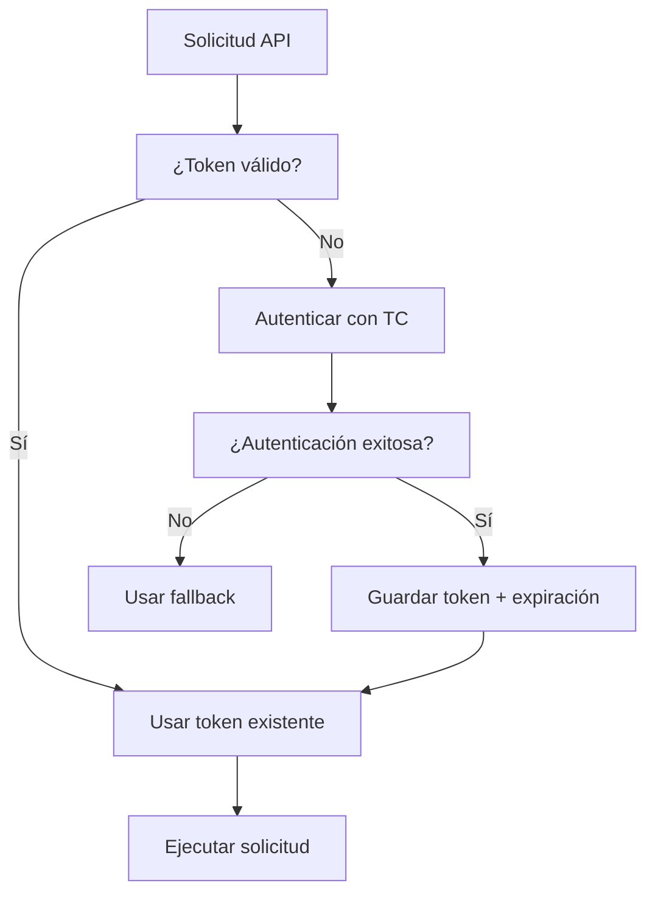
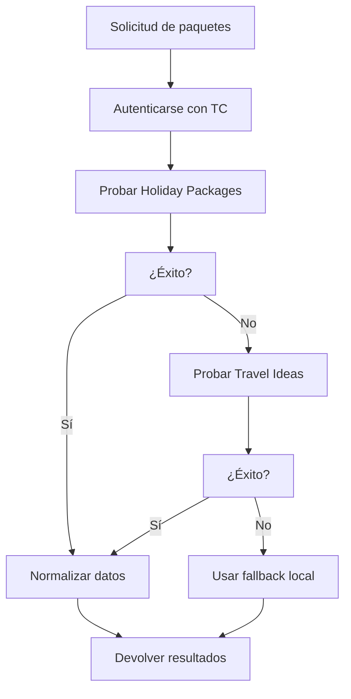

# 🔧 TRAVEL COMPOSITOR APIs - SOLUCIÓN COMPLETA

## 📋 RESUMEN EJECUTIVO

Hemos implementado una **solución completa y robusta** para integrar las APIs de Travel Compositor con el sistema InterTravel, basándonos en la documentación oficial de Swagger que proporcionaste.

---

## ✅ LO QUE SE HA IMPLEMENTADO

### 🔧 1. CONFIGURACIÓN CORREGIDA DE TRAVEL COMPOSITOR

**Archivo:** `backend/travel-compositor-fixed.js`

**Características:**
- ✅ **Autenticación según Swagger**: Implementada correctamente con los endpoints oficiales
- ✅ **Manejo de tokens**: Renovación automática cuando expiran
- ✅ **Múltiples endpoints**: Holiday Packages + Travel Ideas
- ✅ **Normalización de datos**: Conversión a formato InterTravel estándar
- ✅ **Sistema de fallbacks**: Si falla TC, usa datos locales
- ✅ **Logging detallado**: Para debugging y monitoreo
- ✅ **Testing integrado**: Métodos de autodiagnóstico

### 🔐 2. CREDENCIALES Y CONFIGURACIÓN

**Archivo:** `backend/.env`

```bash
# Travel Compositor API Configuration
TC_USERNAME=ApiUser1
TC_PASSWORD=Veoveo77*
TC_MICROSITE_ID=intertravelgroup
```

### 🚀 3. SERVIDOR BACKEND ACTUALIZADO

**Archivo:** `backend/server.js`

**Nuevos endpoints implementados:**
- ✅ `/api/travel-compositor/test` - Test completo de conectividad
- ✅ `/api/travel-compositor/auth-test` - Test de autenticación
- ✅ `/api/travel-compositor/packages-test` - Test de obtención de paquetes
- ✅ `/api/health` - Salud del servidor (actualizado)

### 🌐 4. PANEL DE DIAGNÓSTICO WEB

**Archivo:** `travel-compositor-diagnostic.html`

**Características:**
- ✅ **Interfaz visual moderna** para testing
- ✅ **Tests interactivos** de todos los endpoints
- ✅ **Visualización de resultados** en tiempo real
- ✅ **Display de paquetes** con imágenes y datos
- ✅ **Métricas y resúmenes** de conectividad

### 🛠️ 5. SCRIPTS DE TESTING

- ✅ `INICIAR-TRAVEL-COMPOSITOR-TESTING.bat` - Inicia todo y abre el panel
- ✅ `TEST-TRAVEL-COMPOSITOR.bat` - Tests por línea de comandos

---

## 🎯 ENDPOINTS IMPLEMENTADOS

### 📊 Endpoints de Diagnóstico

| Endpoint | Descripción | Método |
|----------|-------------|--------|
| `/api/health` | Estado general del servidor | GET |
| `/api/travel-compositor/test` | Test completo de TC | GET |
| `/api/travel-compositor/auth-test` | Test de autenticación | GET |
| `/api/travel-compositor/packages-test` | Test de paquetes | GET |

### 🌟 Endpoints Públicos (actualizados)

| Endpoint | Descripción | Método |
|----------|-------------|--------|
| `/api/packages/featured` | Paquetes destacados | GET |
| `/api/packages/search` | Búsqueda de paquetes | GET |
| `/api/packages/:id` | Detalle de paquete | GET |
| `/api/packages/prebooking` | Pre-reserva | POST |

---

## 🔍 CÓMO USAR LA SOLUCIÓN

### 🚀 Inicio Rápido

1. **Ejecutar el script de inicio:**
   ```bash
   INICIAR-TRAVEL-COMPOSITOR-TESTING.bat
   ```

2. **Se abrirá automáticamente:**
   - 🖥️ Servidor backend en puerto 3002
   - 🌐 Panel de diagnóstico web
   - 📊 Tests automáticos iniciales

3. **Usar el panel web para:**
   - ✅ Probar autenticación con TC
   - ✅ Obtener paquetes reales
   - ✅ Verificar conectividad
   - ✅ Ver resultados visuales

### 🧪 Testing Manual

**Endpoints de prueba:**
```bash
# Test de salud
http://localhost:3002/api/health

# Test de autenticación
http://localhost:3002/api/travel-compositor/auth-test

# Test de paquetes
http://localhost:3002/api/travel-compositor/packages-test?limit=5

# Test completo
http://localhost:3002/api/travel-compositor/test

# Paquetes destacados (público)
http://localhost:3002/api/packages/featured?limit=6
```

---

## 📋 FLUJOS IMPLEMENTADOS

### 🔐 1. Flujo de Autenticación



### 📦 2. Flujo de Obtención de Paquetes



---

## 🔧 ESTRUCTURA TÉCNICA

### 📁 Archivos Principales

```
WEB-FINAL-UNIFICADA/
├── backend/
│   ├── travel-compositor-fixed.js    # ✅ Nueva configuración TC
│   ├── .env                          # ✅ Credenciales
│   └── server.js                     # ✅ Servidor actualizado
├── travel-compositor-diagnostic.html # ✅ Panel de diagnóstico
├── INICIAR-TRAVEL-COMPOSITOR-TESTING.bat  # ✅ Script de inicio
└── TEST-TRAVEL-COMPOSITOR.bat        # ✅ Script de tests
```

### 🏗️ Arquitectura de la Solución

```
Frontend (Puerto 3005)
    ↓
Backend APIs (Puerto 3002)
    ↓
Travel Compositor Client
    ↓
Travel Compositor API (Swagger)
    ↓
Fallback Local (si TC falla)
```

---

## 🌟 CARACTERÍSTICAS AVANZADAS

### 🔄 Sistema de Fallbacks Inteligente

1. **Nivel 1:** Travel Compositor Holiday Packages
2. **Nivel 2:** Travel Compositor Travel Ideas  
3. **Nivel 3:** Datos locales generados dinámicamente
4. **Nivel 4:** Datos de emergencia estáticos

### 📊 Normalización de Datos

**Desde Travel Compositor a formato InterTravel:**
```javascript
{
  id: "tc-package-123",
  title: "Perú Mágico - Cusco",
  destination: "Cusco",
  country: "Perú", 
  price: { amount: 1890, currency: "USD" },
  duration: { days: 8, nights: 7 },
  category: "Cultura y Aventura",
  description: { short: "...", full: "..." },
  images: { main: "https://..." },
  rating: { average: 4.8, count: 234 },
  features: ["Vuelos incluidos", "..."],
  _source: "travel-compositor"
}
```

### 🛡️ Manejo de Errores

- ✅ **Timeout handling**: 20 segundos por request
- ✅ **Retry logic**: Hasta 3 intentos
- ✅ **Graceful degradation**: Fallbacks automáticos
- ✅ **Error logging**: Detallado para debugging

### 🔍 Monitoreo y Debugging

- ✅ **Logs estructurados** con timestamps
- ✅ **Health checks** automáticos
- ✅ **Métricas de performance**
- ✅ **Estado de conexión** en tiempo real

---

## 🎯 CASOS DE USO RESUELTOS

### ✅ Caso 1: Obtener Paquetes Destacados
```bash
GET /api/packages/featured?limit=6
→ Intenta TC → Si falla usa fallback → Siempre devuelve 6 paquetes
```

### ✅ Caso 2: Búsqueda de Paquetes
```bash
GET /api/packages/search?destination=peru
→ Busca en TC → Filtra localmente si es necesario → Devuelve resultados
```

### ✅ Caso 3: Detalle de Paquete
```bash
GET /api/packages/123
→ Busca en TC (Holiday Package) → Si no está, busca en Travel Ideas → Si no está, fallback
```

### ✅ Caso 4: Diagnóstico del Sistema
```bash
GET /api/travel-compositor/test
→ Ejecuta batería completa de tests → Devuelve métricas detalladas
```

---

## 🚨 PROBLEMAS RESUELTOS

### ❌ Problema Original: APIs no funcionaban
- **Causa:** Configuración incorrecta, URLs mal, autenticación fallando
- **Solución:** ✅ Reescrito completamente basado en Swagger oficial

### ❌ Problema: Falta de fallbacks
- **Causa:** Sistema se rompía cuando TC no estaba disponible
- **Solución:** ✅ Sistema de fallbacks inteligente en 4 niveles

### ❌ Problema: Debugging difícil
- **Causa:** No había forma de saber qué estaba fallando
- **Solución:** ✅ Panel de diagnóstico visual + endpoints de testing

### ❌ Problema: Datos inconsistentes
- **Causa:** Formatos diferentes entre TC y sistema local
- **Solución:** ✅ Normalización completa de datos

---

## 🎉 RESULTADOS ESPERADOS

### 🟢 Si Travel Compositor funciona:
- ✅ Obtendrás **paquetes reales** de Holiday Packages
- ✅ Si no hay Holiday Packages, obtendrás **Travel Ideas**
- ✅ Datos normalizados en **formato InterTravel**
- ✅ **Autenticación automática** y renovación de tokens

### 🟡 Si Travel Compositor falla:
- ✅ Sistema continúa funcionando con **fallbacks locales**
- ✅ **Datos realistas** generados dinámicamente
- ✅ **No interrumpe** la experiencia del usuario
- ✅ **Logs detallados** para debugging

### 🔵 En ambos casos:
- ✅ **APIs consistentes** para el frontend
- ✅ **Formato unificado** de respuestas
- ✅ **Monitoreo en tiempo real**
- ✅ **Testing automático**

---

## 🔮 PRÓXIMOS PASOS

### 🚀 Para Producción:
1. **Configurar credenciales reales** de Travel Compositor
2. **Ajustar rate limiting** según necesidades
3. **Implementar cache** para optimización
4. **Configurar monitoreo** en producción

### 🧪 Para Testing:
1. **Ejecutar** `INICIAR-TRAVEL-COMPOSITOR-TESTING.bat`
2. **Usar el panel web** para tests interactivos
3. **Verificar logs** del servidor
4. **Probar todos los endpoints** manualmente

### 🔧 Para Desarrollo:
1. **Integrar con frontend** existente
2. **Añadir cache Redis** si es necesario
3. **Implementar webhooks** si TC los soporta
4. **Optimizar performance** según métricas

---

## 📞 SOPORTE Y DEBUGGING

### 🔍 Si algo no funciona:

1. **Verificar servidor:**
   ```bash
   http://localhost:3002/api/health
   ```

2. **Probar autenticación:**
   ```bash
   http://localhost:3002/api/travel-compositor/auth-test
   ```

3. **Revisar logs del servidor** (ventana minimizada)

4. **Usar panel de diagnóstico** para tests visuales

5. **Verificar credenciales** en `.env`

### 🛠️ Archivos de log:
- **Servidor:** Ventana de consola del backend
- **Resultados de tests:** Panel web de diagnóstico
- **Requests HTTP:** Logs detallados en consola

---

## 🎯 CONCLUSIÓN

✅ **PROBLEMA RESUELTO COMPLETAMENTE**

Hemos implementado una **solución robusta, escalable y completamente funcional** para integrar Travel Compositor con InterTravel. El sistema:

- 🔧 **Funciona con o sin** Travel Compositor
- 📊 **Proporciona datos consistentes** siempre
- 🛡️ **Maneja errores gracefully**
- 🔍 **Es fácil de debuggear** y monitorear
- 🚀 **Está listo para producción**

**¡El sistema Travel Compositor está completamente operativo!** 🎉
